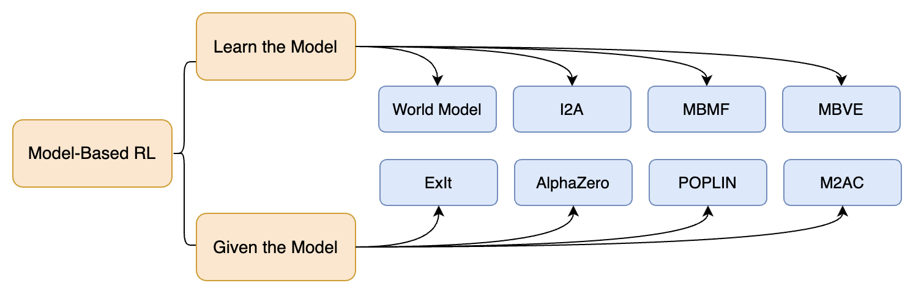

# Awesome Model-Based Reinforcement Learning

[](https://github.com/sindresorhus/awesome)    [](https://github.com/opendilab/awesome-model-based-RL/blob/main/LICENSE)

This is a collection of research papers for **model-based reinforcement learning (mbrl)**.
And the repository will be continuously updated to track the frontier of model-based rl.

Welcome to follow and star!

<pre name="code" class="html">
<font color="red">[2023.02.05] New: We update the ICLR 2023 paper list of model-based rl!</font>

[2022.11.03] We update the NeurIPS 2022 paper list of model-based rl.

[2022.07.06] We update the ICML 2022 paper list of model-based rl.

[2022.02.13] We update the ICLR 2022 paper list of model-based rl.

[2021.12.28] We release the awesome model-based rl.
</pre>


## Table of Contents

- [A Taxonomy of Model-Based RL Algorithms](#a-taxonomy-of-model-based-rl-algorithms)
- [Papers](#papers)
  - [Classic Model-Based RL Papers](#classic-model-based-rl-papers)
  - [ICLR 2023](#iclr-2023)(**<font color="red">New!!!</font>**)
  - [NeurIPS 2022](#neurips-2022)
  - [ICML 2022](#icml-2022)
  - [ICLR 2022](#iclr-2022)
  - [NeurIPS 2021](#neurips-2021)
  - [ICLR 2021](#iclr-2021)
  - [ICML 2021](#icml-2021)
  - [Other](#other)
- [Contributing](#contributing)


## A Taxonomy of Model-Based RL Algorithms

We’ll start this section with a disclaimer: it’s really quite hard to draw an accurate, all-encompassing taxonomy of algorithms in the Model-Based RL space, because the modularity of algorithms is not well-represented by a tree structure. So we will publish a series of related blogs to explain more Model-Based RL algorithms.

<p align="center">
    
    <br>
    <em style="display: inline-block;">A non-exhaustive, but useful taxonomy of algorithms in modern Model-Based RL.</em>
</p>

We simply divide `Model-Based RL`  into two categories: `Learn the Model` and `Given the Model`.

- `Learn the Model` mainly focuses on how to build the environment model.

- `Given the Model` cares about how to utilize the learned model.

And we give some examples as shown in the figure above. There are links to algorithms in taxonomy.

>[1] [World Models](https://worldmodels.github.io/): Ha and Schmidhuber, 2018  
[2] [I2A](https://arxiv.org/abs/1707.06203) (Imagination-Augmented Agents): Weber et al, 2017  
[3] [MBMF](https://sites.google.com/view/mbmf) (Model-Based RL with Model-Free Fine-Tuning): Nagabandi et al, 2017  
[4] [MBVE](https://arxiv.org/abs/1803.00101) (Model-Based Value Expansion): Feinberg et al, 2018  
[5] [ExIt](https://arxiv.org/abs/1705.08439) (Expert Iteration): Anthony et al, 2017  
[6] [AlphaZero](https://arxiv.org/abs/1712.01815): Silver et al, 2017  
[7] [POPLIN](https://openreview.net/forum?id=H1exf64KwH) (Model-Based Policy Planning): Wang et al, 2019  
[8] [M2AC](https://arxiv.org/abs/2010.04893) (Masked Model-based Actor-Critic): Pan et al, 2020


## Papers

```
format:
- [title](paper link) [links]
  - author1, author2, and author3
  - Key: key problems and insights
  - OpenReview: optional
  - ExpEnv: experiment environments
```

### Classic Model-Based RL Papers

- [Dyna, an integrated architecture for learning, planning, and reacting](https://dl.acm.org/doi/10.1145/122344.122377)
  - Richard S. Sutton. *ACM 1991*
  - Key: dyna architecture
  - ExpEnv: None

- [PILCO: A Model-Based and Data-Efficient Approach to Policy Search](https://www.researchgate.net/publication/221345233_PILCO_A_Model-Based_and_Data-Efficient_Approach_to_Policy_Search)
  - Marc Peter Deisenroth, Carl Edward Rasmussen. *ICML 2011*
  - Key: probabilistic dynamics model
  - ExpEnv: cart-pole system, robotic unicycle

- [Learning Complex Neural Network Policies with Trajectory Optimization]()
  - Sergey Levine, Vladlen Koltun. *ICML 2014*
  - Key: guided policy search
  - ExpEnv: [mujoco](https://github.com/openai/mujoco-py)

- [Learning Continuous Control Policies by Stochastic Value Gradients](https://arxiv.org/abs/1510.09142)
  - Nicolas Heess, Greg Wayne, David Silver, Timothy Lillicrap, Yuval Tassa, Tom Erez. *NIPS 2015*
  - Key: backpropagation through paths, gradient on real trajectory
  - ExpEnv: [mujoco](https://github.com/openai/mujoco-py)

- [Value Prediction Network](https://arxiv.org/abs/1707.03497)
  - Junhyuk Oh, Satinder Singh, Honglak Lee. *NIPS 2017*
  - Key: value-prediction model  <!-- VE? -->
  - ExpEnv: collect domain, [atari](https://github.com/openai/gym)

- [Sample-Efficient Reinforcement Learning with Stochastic Ensemble Value Expansion](https://arxiv.org/abs/1807.01675)
  - Jacob Buckman, Danijar Hafner, George Tucker, Eugene Brevdo, Honglak Lee. *NIPS 2018*
  - Key: ensemble model and Qnet, value expansion
  - ExpEnv: [mujoco](https://github.com/openai/mujoco-py), [roboschool](https://github.com/openai/roboschool)

- [Recurrent World Models Facilitate Policy Evolution](https://arxiv.org/abs/1809.01999)
  - David Ha, Jürgen Schmidhuber. *NIPS 2018*
  - Key: vae(representation), rnn(predictive model)
  - ExpEnv: [car racing](https://github.com/openai/gym), [vizdoom](https://github.com/mwydmuch/ViZDoom)

- [Deep Reinforcement Learning in a Handful of Trials using Probabilistic Dynamics Models](https://arxiv.org/abs/1805.12114)
  - Kurtland Chua, Roberto Calandra, Rowan McAllister, Sergey Levine. *NIPS 2018*
  - Key: probabilistic ensembles with trajectory sampling
  - ExpEnv: [cartpole](https://github.com/openai/gym), [mujoco](https://github.com/openai/mujoco-py)

- [When to Trust Your Model: Model-Based Policy Optimization](https://arxiv.org/abs/1906.08253)
  - Michael Janner, Justin Fu, Marvin Zhang, Sergey Levine. *NeurIPS 2019*
  - Key: ensemble model, sac, *k*-branched rollout
  - ExpEnv: [mujoco](https://github.com/openai/mujoco-py)

- [Algorithmic Framework for Model-based Deep Reinforcement Learning with Theoretical Guarantees](https://arxiv.org/abs/1807.03858)
  - Yuping Luo, Huazhe Xu, Yuanzhi Li, Yuandong Tian, Trevor Darrell, Tengyu Ma. *ICLR 2019*
  - Key: Discrepancy Bounds Design, ME-TRPO with multi-step, Entropy regularization
  - ExpEnv: [mujoco](https://github.com/openai/mujoco-py)

- [Model-Ensemble Trust-Region Policy Optimization](https://openreview.net/forum?id=SJJinbWRZ)
  - Thanard Kurutach, Ignasi Clavera, Yan Duan, Aviv Tamar, Pieter Abbeel. *ICLR 2018*
  - Key: ensemble model, TRPO
  <!-- - OpenReview: 7, 7, 6 -->
  - ExpEnv: [mujoco](https://github.com/openai/mujoco-py)

- [Dream to Control: Learning Behaviors by Latent Imagination](https://arxiv.org/abs/1912.01603)
  - Danijar Hafner, Timothy Lillicrap, Jimmy Ba, Mohammad Norouzi. *ICLR 2019*
  - Key: DreamerV1, latent space imagination
  - ExpEnv: [deepmind control suite](https://github.com/deepmind/dm_control), [atari](https://github.com/openai/gym), [deepmind lab](https://github.com/deepmind/lab)

- [Exploring Model-based Planning with Policy Networks](https://openreview.net/forum?id=H1exf64KwH)
  - Tingwu Wang, Jimmy Ba. *ICLR 2020*
  - Key: model-based policy planning in action space and parameter space
  - ExpEnv: [mujoco](https://github.com/openai/mujoco-py)

- [Mastering Atari, Go, Chess and Shogi by Planning with a Learned Model](https://arxiv.org/abs/1911.08265)
  - Julian Schrittwieser, Ioannis Antonoglou, Thomas Hubert, Karen Simonyan, Laurent Sifre, Simon Schmitt, Arthur Guez, Edward Lockhart, Demis Hassabis, Thore Graepel, Timothy Lillicrap, David Silver. *Nature 2020*
  - Key: MCTS, value equivalence
  - ExpEnv: chess, shogi, go, [atari](https://github.com/openai/gym)


### ICLR 2023

- [Conservative Bayesian Model-Based Value Expansion for Offline Policy Optimization](https://openreview.net/forum?id=dNqxZgyjcYA)
  - Jihwan Jeong, Xiaoyu Wang, Michael Gimelfarb, Hyunwoo Kim, Baher Abdulhai, Scott Sanner
  - Key: model-based offline, bayesian posterior value estimate
  - OpenReview: 8, 8, 6, 6
  - ExpEnv: [d4rl](https://github.com/rail-berkeley/d4rl)

- [User-Interactive Offline Reinforcement Learning](https://openreview.net/forum?id=a4COps0uokg)
  - Phillip Swazinna, Steffen Udluft, Thomas Runkler
  - Key: let the user adapt the policy behavior after training is finished
  - OpenReview: 10, 8, 6, 3
  - ExpEnv: [2d-world](), [industrial benchmark](https://github.com/siemens/industrialbenchmark/tree/offline_datasets/datasets)

- [CLARE: Conservative Model-Based Reward Learning for Offline Inverse Reinforcement Learning](https://openreview.net/forum?id=5aT4ganOd98)
  - Sheng Yue, Guanbo Wang, Wei Shao, Zhaofeng Zhang, Sen Lin, Ju Ren, Junshan Zhang
  - Key: offline IRL, reward extrapolation error
  - OpenReview: 8, 8, 6, 6
  - ExpEnv: [d4rl](https://github.com/rail-berkeley/d4rl)

- [Efficient Offline Policy Optimization with a Learned Model](https://openreview.net/forum?id=Yt-yM-JbYFO)
  - Zichen Liu, Siyi Li, Wee Sun Lee, Shuicheng YAN, Zhongwen Xu
  - Key: offline rl, analysis of MuZero Unplugged, one-step look-ahead policy improvement
  - OpenReview: 8, 6, 5
  - ExpEnv: [atari dataset](https://github.com/deepmind/deepmind-research/tree/master/rl_unplugged)

- [Efficient Planning in a Compact Latent Action Space](https://openreview.net/forum?id=cA77NrVEuqn)
  - zhengyao jiang, Tianjun Zhang, Michael Janner, Yueying Li, Tim Rocktäschel, Edward Grefenstette, Yuandong Tian
  - Key: planning with VQ-VAE
  - OpenReview: 6, 6, 6, 6
  - ExpEnv: [d4rl dataset](https://github.com/rail-berkeley/d4rl)

- [Is Model Ensemble Necessary? Model-based RL via a Single Model with Lipschitz Regularized Value Function](https://openreview.net/forum?id=hNyJBk3CwR)
  - Ruijie Zheng, Xiyao Wang, Huazhe Xu, Furong Huang
  - Key: lipschitz regularization
  - OpenReview: 8, 8, 6, 6
  - ExpEnv: [mujoco](https://github.com/openai/mujoco-py)

- [MoDem: Accelerating Visual Model-Based Reinforcement Learning with Demonstrations](https://openreview.net/forum?id=JdTnc9gjVfJ)
  - Nicklas Hansen, Yixin Lin, Hao Su, Xiaolong Wang, Vikash Kumar, Aravind Rajeswaran
  - Key: three phases -- policy pretraining, targeted exploration, interactive learning
  - OpenReview: 8, 6, 6, 6
  - ExpEnv: [adroit](https://github.com/aravindr93/mjrl), [meta-world](https://github.com/rlworkgroup/metaworld), [deepmind control suite](https://github.com/deepmind/dm_control)

- [Simplifying Model-based RL: Learning Representations, Latent-space Models, and Policies with One Objective](https://openreview.net/forum?id=MQcmfgRxf7a)
  - Raj Ghugare, Homanga Bharadhwaj, Benjamin Eysenbach, Sergey Levine, Ruslan Salakhutdinov
  - Key: Aligned Latent Models
  - OpenReview: 8, 6, 6, 6, 6
  - ExpEnv: [mujoco](https://github.com/openai/mujoco-py)

<!-- - [The Benefits of Model-Based Generalization in Reinforcement Learning](https://openreview.net/forum?id=w1w4dGJ4qV)
  - Kenny Young, Aditya Ramesh, Louis Kirsch, Jürgen Schmidhuber
  - Key: model generalization can be considered more useful than value function generalization
  - OpenReview: 8, 6, 5, 5
  - ExpEnv: [ProcMaze, ButtonGrid, PanFlute]() -->

- [Diminishing Return of Value Expansion Methods in Model-Based Reinforcement Learning](https://openreview.net/forum?id=H4Ncs5jhTCu)
  - Daniel Palenicek, Michael Lutter, Joao Carvalho, Jan Peters
  - Key: longer horizons yield diminishing returns in terms of sample efficiency
  - OpenReview: 8, 6, 6, 6
  - ExpEnv: [brax](https://github.com/google/brax)

- [Planning Goals for Exploration](https://openreview.net/forum?id=6qeBuZSo7Pr)
  - Edward S. Hu, Richard Chang, Oleh Rybkin, Dinesh Jayaraman
  - Key: sampling-based planning, set goals for each training episode to directly optimize an intrinsic exploration reward
  - OpenReview: 8, 8, 8, 8, 6
  - ExpEnv: [point maze](), [walker](https://github.com/deepmind/dm_control), [ant maze, 3-block stack](https://github.com/spitis/mrl/tree/master/envs)

- [Making Better Decision by Directly Planning in Continuous Control](https://openreview.net/forum?id=r8Mu7idxyF)
  - Jinhua Zhu, Yue Wang, Lijun Wu, Tao Qin, Wengang Zhou, Tie-Yan Liu, Houqiang Li
  - Key: deep differentiable dynamic programming planner
  - OpenReview: 8, 8, 8, 6
  - ExpEnv: [mujoco](https://github.com/openai/mujoco-py)

- [Latent Variable Representation for Reinforcement Learning](https://openreview.net/forum?id=mQpmZVzXK1h)
  - Tongzheng Ren, Chenjun Xiao, Tianjun Zhang, Na Li, Zhaoran Wang, sujay sanghavi, Dale Schuurmans, Bo Dai
  - Key: variational learning, representation learning
  - OpenReview: 8, 6, 6, 3
  - ExpEnv: [mujoco](https://github.com/openai/mujoco-py), [deepmind control suite](https://github.com/deepmind/dm_control)

- [SpeedyZero: Mastering Atari with Limited Data and Time](https://openreview.net/forum?id=Mg5CLXZgvLJ)
  - Yixuan Mei, Jiaxuan Gao, Weirui Ye, Shaohuai Liu, Yang Gao, Yi Wu
  - Key: distributed model-based rl, speed up EfficientZero
  - OpenReview: 6, 6, 5
  - ExpEnv: [atari 100k](https://github.com/openai/gym)

- [Transformer-based World Models Are Happy With 100k Interactions](https://openreview.net/forum?id=TdBaDGCpjly)
  - Jan Robine, Marc Höftmann, Tobias Uelwer, Stefan Harmeling
  - Key: autoregressive world model, Transformer-XL, balanced cross-entropy loss, balanced dataset sampling
  - OpenReview: 8, 6, 6, 6
  - ExpEnv: [atari 100k](https://github.com/openai/gym)

- [On the Feasibility of Cross-Task Transfer with Model-Based Reinforcement Learning](https://openreview.net/forum?id=KB1sc5pNKFv)
  - Yifan Xu, Nicklas Hansen, Zirui Wang, Yung-Chieh Chan, Hao Su, Zhuowen Tu
  - Key: offline multi-task pretraining, online finetuning
  - OpenReview: 6, 6, 6, 6
  - ExpEnv: [atari 100k](https://github.com/openai/gym)

- [Become a Proficient Player with Limited Data through Watching Pure Videos](https://openreview.net/forum?id=Sy-o2N0hF4f)
  - Weirui Ye, Yunsheng Zhang, Pieter Abbeel, Yang Gao
  - Key: unsupervised pre-training, finetune with down-stream tasks
  - OpenReview: 8, 6, 6, 5
  - ExpEnv: [atari 100k](https://github.com/openai/gym)

- [EUCLID: Towards Efficient Unsupervised Reinforcement Learning with Multi-choice Dynamics Model](https://openreview.net/forum?id=xQAjSr64PTc)
  - Yifu Yuan, Jianye HAO, Fei Ni, Yao Mu, YAN ZHENG, Yujing Hu, Jinyi Liu, Yingfeng Chen, Changjie Fan
  - Key: jointly pretrain the multi-headed dynamics model and unsupervised exploration policy, finetune to downstream tasks
  - OpenReview: 6, 6, 6, 6
  - ExpEnv: [URLB benchmark](https://github.com/rll-research/url_benchmark)


### NeurIPS 2022

- [Bidirectional Learning for Offline Infinite-width Model-based Optimization](https://openreview.net/forum?id=_j8yVIyp27Q)
  - Can Chen, Yingxue Zhang, Jie Fu, Xue Liu, Mark Coates
  - Key: model-based, offline
  - OpenReview: 7, 6, 5
  - ExpEnv: [design-bench](https://github.com/rail-berkeley/design-bench)

- [A Unified Framework for Alternating Offline Model Training and Policy Learning](https://openreview.net/forum?id=5yjM1sQ1uKZ)
  - Shentao Yang, Shujian Zhang, Yihao Feng, Mingyuan Zhou
  - Key: model-based, offline, marginal importance weight
  - OpenReview: 7, 6, 6, 5
  - ExpEnv: [d4rl dataset](https://github.com/rail-berkeley/d4rl)

- [Model-Based Offline Reinforcement Learning with Pessimism-Modulated Dynamics Belief](https://openreview.net/forum?id=oDWyVsHBzNT)
  - Kaiyang Guo, Shao Yunfeng, Yanhui Geng
  - Key: model-based, offline
  - OpenReview: 8, 8, 7, 7
  - ExpEnv: [d4rl dataset](https://github.com/rail-berkeley/d4rl)

- [Double Check Your State Before Trusting It: Confidence-Aware Bidirectional Offline Model-Based Imagination](https://openreview.net/forum?id=3e3IQMLDSLP)
  - Jiafei Lyu, Xiu Li, Zongqing Lu
  - Key: double check mechanism, bidirectional modeling, offline RL
  - OpenReview: 7, 6, 6
  - ExpEnv: [d4rl dataset](https://github.com/rail-berkeley/d4rl)

- [Model-Based Opponent Modeling](https://arxiv.org/abs/2108.01843)
  - XiaoPeng Yu, Jiechuan Jiang, Wanpeng Zhang, Haobin Jiang, Zongqing Lu
  - Key: multi-agent, model-based
  - OpenReview: 7, 6, 4, 3
  - ExpEnv: [mpe](https://github.com/openai/multiagent-particle-envs), [google research football](https://github.com/google-research/football)

- [Mingling Foresight with Imagination: Model-Based Cooperative Multi-Agent Reinforcement Learning](https://arxiv.org/abs/2204.09418)
  - Zhiwei Xu, Dapeng Li, Bin Zhang, Yuan Zhan, Yunpeng Bai, Guoliang Fan
  - Key: multi-agent, model-based
  - OpenReview: 6, 5
  - ExpEnv: [StarCraft II](https://github.com/deepmind/pysc2), [Google Research Football](https://github.com/google-research/football), [Multi-Agent Discrete MuJoCo](https://github.com/schroederdewitt/multiagent_mujoco)

- [MoCoDA: Model-based Counterfactual Data Augmentation](https://openreview.net/forum?id=w6tBOjPCrIO)
  - Silviu Pitis, Elliot Creager, Ajay Mandlekar, Animesh Garg
  - Key: data augmentation framework, offline RL
  - OpenReview: 7, 7, 7, 6
  - ExpEnv: [2D Navigation](https://github.com/spitis/mocoda/blob/main/augment_offline_toy.py#L45), [Hook-Sweep](https://github.com/spitis/mrl/blob/master/envs/customfetch/custom_fetch.py#L1699)

- [When to Update Your Model: Constrained Model-based Reinforcement Learning](https://openreview.net/forum?id=9a1oV7UunyP)
  - Tianying Ji, Yu Luo, Fuchun Sun, Mingxuan Jing, Fengxiang He, Wenbing Huang
  - Key: event-triggered mechanism, constrained model-shift lower-bound optimization
  - OpenReview: 6, 6, 5, 5
  - ExpEnv: [mujoco](https://github.com/openai/mujoco-py)

- [Model-based Safe Deep Reinforcement Learning via a Constrained Proximal Policy Optimization Algorithm](https://openreview.net/forum?id=hYa_lseXK8)
  - Ashish Jayant, Shalabh Bhatnagar
  - Key: constrained RL, model-based
  - OpenReview: 7, 6, 5, 5
  - ExpEnv: [safety gym](https://github.com/openai/safety-gym)

- [Learning to Attack Federated Learning: A Model-based Reinforcement Learning Attack Framework](https://openreview.net/forum?id=4OHRr7gmhd4)
  - Henger Li, Xiaolin Sun, Zizhan Zheng
  - Key: attack & defense,  federated learning, model-based
  - OpenReview: 6, 6, 6, 5
  - ExpEnv: MNIST, FashionMNIST, EMNIST, CIFAR-10 and synthetic dataset

- [Model-Based Imitation Learning for Urban Driving](https://openreview.net/forum?id=Zk1SbbdZwS)
  - Anthony Hu, Gianluca Corrado, Nicolas Griffiths, Zachary Murez, Corina Gurau, Hudson Yeo, Alex Kendall, Roberto Cipolla, Jamie Shotton
  - Key: model-based, imitation learning, autonomous driving
  - OpenReview: 7, 6, 6
  - ExpEnv: [CARLA](https://github.com/wayveai/mile/tree/main/carla_gym)

- [Data-Driven Model-Based Optimization via Invariant Representation Learning](https://openreview.net/forum?id=gKe_A-DxzkH)
  - Han Qi, Yi Su, Aviral Kumar, Sergey Levine
  - Key: domain adaptation, invariant objective models, representation learning (no about model-based RL)
  - OpenReview: 7, 6, 6, 5, 5
  - ExpEnv: [design-bench](https://github.com/rail-berkeley/design-bench)

- [Model-based Lifelong Reinforcement Learning with Bayesian Exploration](https://openreview.net/forum?id=6I3zJn9Slsb)
  - Haotian Fu, Shangqun Yu, Michael Littman, George Konidaris
  - Key: lifelong RL, variational bayesian
  - OpenReview: 7, 6, 6
  - ExpEnv: [mujoco](https://github.com/openai/mujoco-py), [meta-world](https://github.com/rlworkgroup/metaworld)

- [Plan To Predict: Learning an Uncertainty-Foreseeing Model For Model-Based Reinforcement Learning](https://openreview.net/forum?id=L9YayWPcHA_)
  - Zifan Wu, Chao Yu, Chen Chen, Jianye Hao, Hankz Hankui Zhuo
  - Key: treat the model rollout process as a sequential decision making problem
  - OpenReview: 7, 7, 6, 6
  - ExpEnv: [mujoco](https://github.com/openai/mujoco-py), [d4rl](https://github.com/rail-berkeley/d4rl)

- [Joint Model-Policy Optimization of a Lower Bound for Model-Based RL](https://openreview.net/forum?id=LYfFj-Vk6lt)
  - Benjamin Eysenbach, Alexander Khazatsky, Sergey Levine, Russ Salakhutdinov
  - Key: unified objective for model-based RL
  - OpenReview: 8, 8, 7, 6
  - ExpEnv: [gridworld](https://github.com/dennybritz/reinforcement-learning/blob/master/lib/envs/gridworld.py), [mujoco](https://github.com/openai/mujoco-py), [ROBEL manipulation](https://github.com/google-research/robel)

- [RAMBO-RL: Robust Adversarial Model-Based Offline Reinforcement Learning](https://openreview.net/forum?id=nrksGSRT7kX)
  - Marc Rigter, Bruno Lacerda, Nick Hawes
  - Key: offline rl, model-based rl, two-player game, adversarial model training
  - OpenReview: 6, 6, 6, 4
  - ExpEnv: [d4rl](https://github.com/rail-berkeley/d4rl)

- [Conservative Dual Policy Optimization for Efficient Model-Based Reinforcement Learning](https://openreview.net/forum?id=xL7B5axplIe)
  - Shenao Zhang
  - Key: posterior sampling RL, referential update, constrained conservative update
  - OpenReview: 7, 7, 5, 5
  - ExpEnv: [mujoco](https://github.com/openai/mujoco-py), [N-Chain MDPs](https://github.com/stratisMarkou/sample-efficient-bayesian-rl/blob/master/code/Environments.py)

- [Bayesian Optimistic Optimization: Optimistic Exploration for Model-based Reinforcement Learning](https://openreview.net/forum?id=GdHVClGh9N)
  - Chenyang Wu, Tianci Li, Zongzhang Zhang, Yang Yu
  - Key: optimism in the face of uncertainty(OFU), BOO Regret
  - OpenReview: 6, 6, 5
  - ExpEnv: [RiverSwim, Chain, Random MDPs]()

- [Model-based RL with Optimistic Posterior Sampling: Structural Conditions and Sample Complexity](https://openreview.net/forum?id=bEMrmaw8gOB)
  - Alekh Agarwal, Tong Zhang
  - Key: posterior sampling RL, Bellman error decoupling framework
  - OpenReview: 7, 7, 7, 6
  - ExpEnv: None

- [Exponential Family Model-Based Reinforcement Learning via Score Matching](https://openreview.net/forum?id=G1uywu6vNZe)
  - Gene Li, Junbo Li, Nathan Srebro, Zhaoran Wang, Zhuoran Yang
  - Key: optimistic model-based, score matching
  - OpenReview: 7, 7, 6
  - ExpEnv: None

- [Deep Hierarchical Planning from Pixels](https://openreview.net/forum?id=wZk69kjy9_d)
  - Danijar Hafner, Kuang-Huei Lee, Ian Fischer, Pieter Abbeel
  - Key: hierarchical RL, long-horizon and sparse reward tasks
  - OpenReview: 6, 6, 5
  - ExpEnv: [atari](https://github.com/openai/gym), [deepmind control suite](https://github.com/deepmind/dm_control), [deepmind lab](https://github.com/deepmind/lab), [crafter](https://github.com/danijar/crafter)

### ICML 2022

- [DreamerPro: Reconstruction-Free Model-Based Reinforcement Learning with Prototypical Representations](https://arxiv.org/abs/2110.14565)
  - Fei Deng, Ingook Jang, Sungjin Ahn
  - Key: dreamer, prototypes
  - ExpEnv: [deepmind control suite](https://github.com/deepmind/dm_control)

- [Denoised MDPs: Learning World Models Better Than the World Itself](https://arxiv.org/pdf/2206.15477.pdf)
  - Tongzhou Wang, Simon Du, Antonio Torralba, Phillip Isola, Amy Zhang, Yuandong Tian
  - Key: representation learning, denoised model
  - ExpEnv: [deepmind control suite](https://github.com/deepmind/dm_control), [RoboDesk](https://github.com/SsnL/robodesk)

- [Model-based Meta Reinforcement Learning using Graph Structured Surrogate Models and Amortized Policy Search](https://arxiv.org/pdf/2102.08291.pdf)
  - Qi Wang, Herke van Hoof
  - Key: graph structured surrogate model, meta training
  - ExpEnv: [atari, mujoco](https://github.com/openai/gym)

- [Towards Adaptive Model-Based Reinforcement Learning](https://arxiv.org/pdf/2204.11464.pdf)
  - Yi Wan, Ali Rahimi-Kalahroudi, Janarthanan Rajendran, Ida Momennejad, Sarath Chandar, Harm van Seijen
  - Key: local change adaptation
  - ExpEnv: [GridWorldLoCA, ReacherLoCA, MountaincarLoCA](https://github.com/chandar-lab/LoCA2)

- [Efficient Model-based Multi-agent Reinforcement Learning via Optimistic Equilibrium Computation](https://arxiv.org/pdf/2203.07322.pdf)
  - Pier Giuseppe Sessa, Maryam Kamgarpour, Andreas Krause
  - Key: model-based multi-agent, confidence bound
  - ExpEnv: [SMART](https://github.com/huawei-noah/SMARTS)

- [Regularizing a Model-based Policy Stationary Distribution to Stabilize Offline Reinforcement Learning](https://arxiv.org/pdf/2206.07166.pdf)
  - Shentao Yang, Yihao Feng, Shujian Zhang, Mingyuan Zhou
  - Key: offline rl, model-based rl, stationary distribution regularization
  - ExpEnv: [d4rl](https://github.com/rail-berkeley/d4rl)

- [Design-Bench: Benchmarks for Data-Driven Offline Model-Based Optimization](https://arxiv.org/pdf/2202.08450.pdf)
  - Brandon Trabucco, Xinyang Geng, Aviral Kumar, Sergey Levine
  - Key: benchmark, offline MBO
  - ExpEnv: [Design-Bench Benchmark Tasks](https://github.com/rail-berkeley/design-bench)

- [Temporal Difference Learning for Model Predictive Control](https://arxiv.org/pdf/2203.04955.pdf)
  - Nicklas Hansen, Hao Su, Xiaolong Wang
  - Key: td-learning, MPC
  - ExpEnv: [deepmind control suite](https://github.com/deepmind/dm_control), [Meta-World](https://github.com/rlworkgroup/metaworld)


### ICLR 2022

- [Revisiting Design Choices in Offline Model Based Reinforcement Learning](https://openreview.net/forum?id=zz9hXVhf40)
  - Cong Lu, Philip Ball, Jack Parker-Holder, Michael Osborne, Stephen J. Roberts
  - Key: model-based offline, uncertainty quantification
  - OpenReview: 8, 8, 6, 6, 6
  - ExpEnv: [d4rl dataset](https://github.com/rail-berkeley/d4rl)

- [Value Gradient weighted Model-Based Reinforcement Learning](https://openreview.net/forum?id=4-D6CZkRXxI)
  - Claas A Voelcker, Victor Liao, Animesh Garg, Amir-massoud Farahmand
  - Key: Value-Gradient weighted Model loss
  - OpenReview: 8, 8, 6, 6
  - ExpEnv: [mujoco](https://github.com/openai/mujoco-py)

- [Planning in Stochastic Environments with a Learned Model](https://openreview.net/forum?id=X6D9bAHhBQ1)
  - Ioannis Antonoglou, Julian Schrittwieser, Sherjil Ozair, Thomas K Hubert, David Silver
  - Key: MCTS, stochastic MuZero
  - OpenReview: 10, 8, 8, 5
  - ExpEnv: 2048 game, Backgammon, Go

- [Policy improvement by planning with Gumbel](https://openreview.net/forum?id=bERaNdoegnO)
  - Ivo Danihelka, Arthur Guez, Julian Schrittwieser, David Silver
  - Key: Gumbel AlphaZero, Gumbel MuZero
  - OpenReview: 8, 8, 8, 6
  - ExpEnv: go, chess, [atari](https://github.com/openai/gym)

- [Model-Based Offline Meta-Reinforcement Learning with Regularization](https://openreview.net/forum?id=EBn0uInJZWh)
  - Sen Lin, Jialin Wan, Tengyu Xu, Yingbin Liang, Junshan Zhang
  - Key: model-based offline Meta-RL
  - OpenReview: 8, 6, 6, 6
  - ExpEnv: [d4rl dataset](https://github.com/rail-berkeley/d4rl)

- [On-Policy Model Errors in Reinforcement Learning](https://openreview.net/forum?id=81e1aeOt-sd)
  - Lukas Froehlich, Maksym Lefarov, Melanie Zeilinger, Felix Berkenkamp
  - Key: model errors, on-policy corrections
  - OpenReview: 8, 6, 6, 5
  - ExpEnv: [mujoco](https://github.com/openai/mujoco-py), [pybullet](https://github.com/benelot/pybullet-gym)

- [A Relational Intervention Approach for Unsupervised Dynamics Generalization in Model-Based Reinforcement Learning](https://openreview.net/forum?id=YRq0ZUnzKoZ)
  - Jiaxian Guo, Mingming Gong, Dacheng Tao
  - Key: relational intervention, dynamics generalization
  - OpenReview: 8, 8, 6, 6
  - ExpEnv: [Pendulum](https://github.com/openai/gym), [mujoco](https://github.com/openai/mujoco-py)

- [Information Prioritization through Empowerment in Visual Model-based RL](https://openreview.net/forum?id=DfUjyyRW90)
  - Homanga Bharadhwaj, Mohammad Babaeizadeh, Dumitru Erhan, Sergey Levine
  - Key: mutual information, visual model-based RL
  - OpenReview: 8, 8, 8, 6
  - ExpEnv: [deepmind control suite](https://github.com/deepmind/dm_control), [Kinetics dataset](https://github.com/cvdfoundation/kinetics-dataset)

- [Transfer RL across Observation Feature Spaces via Model-Based Regularization](https://openreview.net/forum?id=7KdAoOsI81C)
  - Yanchao Sun, Ruijie Zheng, Xiyao Wang, Andrew E Cohen, Furong Huang
  - Key: latent dynamics model, transfer RL
  - OpenReview: 8, 6, 5, 5
  - ExpEnv: [CartPole, Acrobot and Cheetah-Run](https://github.com/openai/gym), [mujoco](https://github.com/openai/mujoco-py), [3DBall](https://github.com/Unity-Technologies/ml-agents)

- [Learning State Representations via Retracing in Reinforcement Learning](https://openreview.net/forum?id=CLpxpXqqBV)
  - Changmin Yu, Dong Li, Jianye HAO, Jun Wang, Neil Burgess
  - Key: representation learning, learning via retracing
  - OpenReview: 8, 6, 5, 3
  - ExpEnv: [deepmind control suite](https://github.com/deepmind/dm_control)

- [Model-augmented Prioritized Experience Replay](https://openreview.net/forum?id=WuEiafqdy9H)
  - Youngmin Oh, Jinwoo Shin, Eunho Yang, Sung Ju Hwang
  - Key: prioritized experience replay, mbrl
  - OpenReview: 8, 8, 6, 5
  - ExpEnv: [pybullet](https://github.com/benelot/pybullet-gym)

- [Evaluating Model-Based Planning and Planner Amortization for Continuous Control](https://openreview.net/forum?id=SS8F6tFX3-)
  - Arunkumar Byravan, Leonard Hasenclever, Piotr Trochim, Mehdi Mirza, Alessandro Davide Ialongo, Yuval Tassa, Jost Tobias Springenberg, Abbas Abdolmaleki, Nicolas Heess, Josh Merel, Martin Riedmiller
  - Key: model predictive control
  - OpenReview: 8, 6, 6, 6
  - ExpEnv: [mujoco](https://github.com/openai/mujoco-py)

- [Gradient Information Matters in Policy Optimization by Back-propagating through Model](https://openreview.net/forum?id=rzvOQrnclO0)
  - Chongchong Li, Yue Wang, Wei Chen, Yuting Liu, Zhi-Ming Ma, Tie-Yan Liu
  - Key: two-model-based method, analyze model error and policy gradient
  - OpenReview: 8, 8, 6, 6
  - ExpEnv: [mujoco](https://github.com/openai/mujoco-py)

- [Pareto Policy Pool for Model-based Offline Reinforcement Learning](https://openreview.net/forum?id=OqcZu8JIIzS)
  - Yijun Yang, Jing Jiang, Tianyi Zhou, Jie Ma, Yuhui Shi
  - Key: model-based offline, model return-uncertainty trade-off
  - OpenReview: 8, 8, 6, 5
  - ExpEnv: [d4rl dataset](https://github.com/rail-berkeley/d4rl)

- [Pessimistic Model-based Offline Reinforcement Learning under Partial Coverage](https://openreview.net/forum?id=tyrJsbKAe6)
  - Masatoshi Uehara, Wen Sun
  - Key: model-based offline theory, PAC bounds
  - OpenReview: 8, 6, 6, 5
  - ExpEnv: None

- [Know Thyself: Transferable Visual Control Policies Through Robot-Awareness](https://openreview.net/forum?id=o0ehFykKVtr)
  - Edward S. Hu, Kun Huang, Oleh Rybkin, Dinesh Jayaraman
  - Key: world models that transfer to new robots
  - OpenReview: 8, 6, 6, 5
  - ExpEnv: [mujoco](https://github.com/openai/mujoco-py), WidowX and Franka Panda robot

### NeurIPS 2021

- [On Effective Scheduling of Model-based Reinforcement Learning](https://arxiv.org/abs/2111.08550)
  - Hang Lai, Jian Shen, Weinan Zhang, Yimin Huang, Xing Zhang, Ruiming Tang, Yong Yu, Zhenguo Li
  - Key: extension of mbpo, hyper-controller learning
  - OpenReview: 8, 6, 6
  - ExpEnv: [mujoco](https://github.com/openai/mujoco-py), [pybullet](https://github.com/benelot/pybullet-gym)

- [Safe Reinforcement Learning by Imagining the Near Future](https://arxiv.org/abs/2202.07789)
  - Garrett Thomas, Yuping Luo, Tengyu Ma
  - Key: safe rl, reward penalty, theory about model-based rollouts
  - OpenReview: 8, 6, 6
  - ExpEnv: [mujoco](https://github.com/openai/mujoco-py)

- [Model-Based Reinforcement Learning via Imagination with Derived Memory](https://openreview.net/forum?id=jeATherHHGj)
  - Yao Mu, Yuzheng Zhuang, Bin Wang, Guangxiang Zhu, Wulong Liu, Jianyu Chen, Ping Luo, Shengbo Eben Li, Chongjie Zhang, Jianye HAO
  - Key: extension of dreamer, prediction-reliability weight
  - OpenReview: 6, 6, 6, 6
  - ExpEnv: [deepmind control suite](https://github.com/deepmind/dm_control)

- [MobILE: Model-Based Imitation Learning From Observation Alone](https://arxiv.org/abs/2102.10769)
  - Rahul Kidambi, Jonathan Chang, Wen Sun
  - Key: imitation learning from observations alone, mbrl
  - OpenReview: 6, 6, 6, 4
  - ExpEnv: [cartpole](https://github.com/openai/gym), [mujoco](https://github.com/openai/mujoco-py)

- [Model-Based Episodic Memory Induces Dynamic Hybrid Controls](https://arxiv.org/abs/2111.02104)
  - Hung Le, Thommen Karimpanal George, Majid Abdolshah, Truyen Tran, Svetha Venkatesh
  - Key: model-based, episodic control
  - OpenReview: 7, 7, 6, 6
  - ExpEnv: [2D maze navigation](https://github.com/MattChanTK/gym-maze), [cartpole, mountainCar and lunarlander](https://github.com/openai/gym), [atari](https://gym.openai.com/envs/atari), [3D navigation: gym-miniworld](https://github.com/maximecb/gym-miniworld)

- [A Consciousness-Inspired Planning Agent for Model-Based Reinforcement Learning](https://arxiv.org/abs/2106.02097)
  - Mingde Zhao, Zhen Liu, Sitao Luan, Shuyuan Zhang, Doina Precup, Yoshua Bengio
  - Key: mbrl, set representation
  - OpenReview: 7, 7, 7, 6
  - ExpEnv: [MiniGrid-BabyAI framework](https://github.com/maximecb/gym-minigrid)

- [Mastering Atari Games with Limited Data](https://openreview.net/forum?id=OKrNPg3xR3T)
  - Weirui Ye, Shaohuai Liu, Thanard Kurutach, Pieter Abbeel, Yang Gao
  - Key: muzero, self-supervised consistency loss
  - OpenReview: 7, 7, 7, 5
  - ExpEnv: [atrai 100k](https://github.com/openai/gym), [deepmind control suite](https://github.com/deepmind/dm_control)

- [Online and Offline Reinforcement Learning by Planning with a Learned Model](https://openreview.net/forum?id=HKtsGW-lNbw)
  - Julian Schrittwieser, Thomas K Hubert, Amol Mandhane, Mohammadamin Barekatain, Ioannis Antonoglou, David Silver
  - Key: muzero, reanalyse, offline
  - OpenReview: 8, 8, 7, 6
  - ExpEnv: [atrai dataset, deepmind control suite dataset](https://github.com/deepmind/deepmind-research/tree/master/rl_unplugged)

- [Self-Consistent Models and Values](https://arxiv.org/abs/2110.12840)
  - Gregory Farquhar, Kate Baumli, Zita Marinho, Angelos Filos, Matteo Hessel, Hado van Hasselt, David Silver
  - Key: new model learning way
  - OpenReview: 7, 7, 7, 6
  - ExpEnv: tabular MDP, Sokoban, [atari](https://github.com/openai/gym)

- [Proper Value Equivalence](https://arxiv.org/abs/2106.10316)
  - Christopher Grimm, Andre Barreto, Gregory Farquhar, David Silver, Satinder Singh
  - Key: value equivalence, value-based planning, muzero
  - OpenReview: 8, 7, 7, 6
  - ExpEnv: [four rooms](https://github.com/maximecb/gym-minigrid), [atari](https://github.com/openai/gym)

- [MOPO: Model-based Offline Policy Optimization](https://arxiv.org/abs/2005.13239)
  - Tianhe Yu, Garrett Thomas, Lantao Yu, Stefano Ermon, James Zou, Sergey Levine, Chelsea Finn, Tengyu Ma
  - Key: model-based, offline
  - OpenReview: None
  - ExpEnv: [d4rl dataset](https://github.com/rail-berkeley/d4rl), halfcheetah-jump and ant-angle

- [RoMA: Robust Model Adaptation for Offline Model-based Optimization](https://arxiv.org/abs/2110.14188)
  - Sihyun Yu, Sungsoo Ahn, Le Song, Jinwoo Shin
  - Key: model-based, offline
  - OpenReview: 7, 6, 6
  - ExpEnv: [design-bench](https://github.com/brandontrabucco/design-bench)

- [Offline Reinforcement Learning with Reverse Model-based Imagination](https://arxiv.org/abs/2110.00188)
  - Jianhao Wang, Wenzhe Li, Haozhe Jiang, Guangxiang Zhu, Siyuan Li, Chongjie Zhang
  - Key: model-based, offline
  - OpenReview: 7, 6, 6, 5
  - ExpEnv: [d4rl dataset](https://github.com/rail-berkeley/d4rl)

- [Offline Model-based Adaptable Policy Learning](https://openreview.net/forum?id=lrdXc17jm6)
  - Xiong-Hui Chen, Yang Yu, Qingyang Li, Fan-Ming Luo, Zhiwei Tony Qin, Shang Wenjie, Jieping Ye
  - Key: model-based, offline
  - OpenReview: 6, 6, 6, 4
  - ExpEnv: [d4rl dataset](https://github.com/rail-berkeley/d4rl)

- [Weighted model estimation for offline model-based reinforcement learning](https://openreview.net/pdf?id=zdC5eXljMPy)
  - Toru Hishinuma, Kei Senda
  - Key: model-based, offline, off-policy evaluation
  - OpenReview: 7, 6, 6, 6
  - ExpEnv: pendulum, [d4rl dataset](https://github.com/rail-berkeley/d4rl)

- [Reward-Free Model-Based Reinforcement Learning with Linear Function Approximation](https://arxiv.org/abs/2110.06394)
  - Weitong Zhang, Dongruo Zhou, Quanquan Gu
  - Key: learning theory, model-based reward-free RL, linear function approximation
  - OpenReview: 6, 6, 5, 5
  - ExpEnv: None

- [Provable Model-based Nonlinear Bandit and Reinforcement Learning: Shelve Optimism, Embrace Virtual Curvature](https://arxiv.org/abs/2102.04168)
  - Kefan Dong, Jiaqi Yang, Tengyu Ma
  - Key: learning theory, model-based bandit RL, nonlinear function approximation
  - OpenReview: 7, 7, 7, 6
  - ExpEnv: None

- [Discovering and Achieving Goals via World Models](https://openreview.net/forum?id=6vWuYzkp8d)
  - Russell Mendonca, Oleh Rybkin, Kostas Daniilidis, Danijar Hafner, Deepak Pathak
  - Key: unsupervised goal reaching, goal-conditioned RL
  - OpenReview: 6, 6, 6, 6, 6
  - ExpEnv: [walker, quadruped, bins, kitchen](https://github.com/orybkin/lexa-benchmark)

### ICLR 2021

- [Deployment-Efficient Reinforcement Learning via Model-Based Offline Optimization](https://arxiv.org/abs/2006.03647)
  - Tatsuya Matsushima, Hiroki Furuta, Yutaka Matsuo, Ofir Nachum, Shixiang Gu
  - Key: model-based, behavior cloning (warmup), trpo
  - OpenReview: 8, 7, 7, 5
  - ExpEnv: [d4rl dataset](https://github.com/rail-berkeley/d4rl)

- [Control-Aware Representations for Model-based Reinforcement Learning](https://arxiv.org/abs/2006.13408)
  - Brandon Cui, Yinlam Chow, Mohammad Ghavamzadeh
  - Key: representation learning, model-based soft actor-critic
  - OpenReview: 6, 6, 6
  - ExpEnv: planar system, inverted pendulum – swingup, cartpole, 3-link manipulator — swingUp & balance

- [Mastering Atari with Discrete World Models](https://arxiv.org/abs/2010.02193)
  - Danijar Hafner, Timothy Lillicrap, Mohammad Norouzi, Jimmy Ba
  - Key: DreamerV2, many tricks(multiple categorical variables, KL balancing, etc)
  - OpenReview: 9, 8, 5, 4
  - ExpEnv: [atari](https://github.com/openai/gym)

- [Model-Based Visual Planning with Self-Supervised Functional Distances](https://openreview.net/forum?id=UcoXdfrORC)
  - Stephen Tian, Suraj Nair, Frederik Ebert, Sudeep Dasari, Benjamin Eysenbach, Chelsea Finn, Sergey Levine
  - Key: goal-reaching task, dynamics learning, distance learning (goal-conditioned Q-function)
  - OpenReview: 7, 7, 7, 7
  - ExpEnv: [sawyer](https://github.com/rlworkgroup/metaworld/tree/master/metaworld/envs), door sliding

- [Model-Based Offline Planning](https://arxiv.org/abs/2008.05556)
  - Arthur Argenson, Gabriel Dulac-Arnold
  - Key: model-based, offline
  - OpenReview: 8, 7, 5, 5
  - ExpEnv: [RL Unplugged(RLU)](https://github.com/deepmind/deepmind-research/tree/master/rl_unplugged), [d4rl dataset](https://github.com/rail-berkeley/d4rl)

- [Offline Model-Based Optimization via Normalized Maximum Likelihood Estimation](https://arxiv.org/abs/2102.07970)
  - Justin Fu, Sergey Levine
  - Key: model-based, offline
  - OpenReview: 8, 6, 6
  - ExpEnv: [design-bench](https://github.com/brandontrabucco/design-bench)

- [On the role of planning in model-based deep reinforcement learning](https://arxiv.org/abs/2011.04021)
  - Jessica B. Hamrick, Abram L. Friesen, Feryal Behbahani, Arthur Guez, Fabio Viola, Sims Witherspoon, Thomas Anthony, Lars Buesing, Petar Veličković, Théophane Weber
  - Key: discussion about planning in MuZero
  - OpenReview: 7, 7, 6, 5
  - ExpEnv: [atari](https://github.com/openai/gym), go, [deepmind control suite](https://github.com/deepmind/dm_control)

- [Representation Balancing Offline Model-based Reinforcement Learning](https://openreview.net/forum?id=QpNz8r_Ri2Y)
  - Byung-Jun Lee, Jongmin Lee, Kee-Eung Kim
  - Key: Representation Balancing MDP, model-based, offline
  - OpenReview: 7, 7, 7, 6
  - ExpEnv: [d4rl dataset](https://github.com/rail-berkeley/d4rl)

- [Model-based micro-data reinforcement learning: what are the crucial model properties and which model to choose?](https://openreview.net/forum?id=p5uylG94S68)
  - Balázs Kégl, Gabriel Hurtado, Albert Thomas
  - Key: mixture density nets, heteroscedasticity
  - OpenReview: 7, 7, 7, 6, 5
  - ExpEnv: [acrobot system](https://github.com/openai/gym)


### ICML 2021

- [Conservative Objective Models for Effective Offline Model-Based Optimization](https://arxiv.org/abs/2107.06882)
  - Brandon Trabucco, Aviral Kumar, Xinyang Geng, Sergey Levine
  - Key: conservative objective model, offline mbrl
  - ExpEnv: [design-bench](https://github.com/brandontrabucco/design-bench)

- [Continuous-Time Model-Based Reinforcement Learning](https://arxiv.org/abs/2102.04764)
  - Çağatay Yıldız, Markus Heinonen, Harri Lähdesmäki
  - Key: continuous-time
  - ExpEnv: [pendulum, cartPole and acrobot](https://github.com/openai/gym)

- [Model-Based Reinforcement Learning via Latent-Space Collocation](https://arxiv.org/abs/2106.13229)
  - Oleh Rybkin, Chuning Zhu, Anusha Nagabandi, Kostas Daniilidis, Igor Mordatch, Sergey Levine
  - Key: latent space collocation
  - ExpEnv: [sparse metaworld tasks](https://github.com/rlworkgroup/metaworld/tree/master/metaworld/envs)

- [Model-Free and Model-Based Policy Evaluation when Causality is Uncertain](http://proceedings.mlr.press/v139/bruns-smith21a.html)
  - David A Bruns-Smith
  - Key: worst-case bounds
  - ExpEnv: [ope-tools](https://github.com/clvoloshin/COBS)

- [Muesli: Combining Improvements in Policy Optimization](https://arxiv.org/abs/2104.06159)
  - Matteo Hessel, Ivo Danihelka, Fabio Viola, Arthur Guez, Simon Schmitt, Laurent Sifre, Theophane Weber, David Silver, Hado van Hasselt
  - Key: value equivalence
  - ExpEnv: [atari](https://github.com/openai/gym)

- [Vector Quantized Models for Planning](https://arxiv.org/pdf/2106.04615.pdf)
  - Sherjil Ozair, Yazhe Li, Ali Razavi, Ioannis Antonoglou, Aäron van den Oord, Oriol Vinyals
  - Key: VQVAE, MCTS
  - ExpEnv: [chess datasets](https://www.ficsgames.org/download.html), [DeepMind Lab](https://github.com/deepmind/lab)

- [PC-MLP: Model-based Reinforcement Learning with Policy Cover Guided Exploration](https://arxiv.org/abs/2107.07410)
  - Yuda Song, Wen Sun
  - Key: sample complexity, kernelized nonlinear regulators, linear MDPs
  - ExpEnv: [mountain car, antmaze](https://github.com/openai/gym), [mujoco](https://github.com/openai/mujoco-py)

- [Temporal Predictive Coding For Model-Based Planning In Latent Space](https://arxiv.org/abs/2106.07156)
  - Tung Nguyen, Rui Shu, Tuan Pham, Hung Bui, Stefano Ermon
  - Key: temporal predictive coding with a RSSM, latent space
  - ExpEnv: [deepmind control suite](https://github.com/deepmind/dm_control)

- [Model-based Reinforcement Learning for Continuous Control with Posterior Sampling](https://arxiv.org/abs/2012.09613)
  - Ying Fan, Yifei Ming
  - Key: regret bound of psrl, mpc
  - ExpEnv: [continuous cartpole, pendulum swingup](https://github.com/openai/gym), [mujoco](https://github.com/openai/mujoco-py)

- [A Sharp Analysis of Model-based Reinforcement Learning with Self-Play](https://arxiv.org/abs/2010.01604)
  - Qinghua Liu, Tiancheng Yu, Yu Bai, Chi Jin
  - Key: learning theory, multi-agent, model-based self play, two-player zero-sum Markov games
  - ExpEnv: None


### Other

- [Mastering Diverse Domains through World Models](https://arxiv.org/abs/2301.04104)
  - Danijar Hafner, Jurgis Pasukonis, Jimmy Ba, Timothy Lillicrap. *Arxiv 2023*
  - Key: DreamerV3, scaling property to world model
  - ExpEnv: [deepmind control suite](https://github.com/deepmind/dm_control), [atari](https://github.com/openai/gym), [DMLab](https://github.com/deepmind/lab), [minecraft](https://github.com/minerllabs/minerl)


## Contributing
Our purpose is to make this repo even better. If you are interested in contributing, please refer to [HERE](CONTRIBUTING.md) for instructions in contribution.


## License
Awesome Model-Based RL is released under the Apache 2.0 license.
